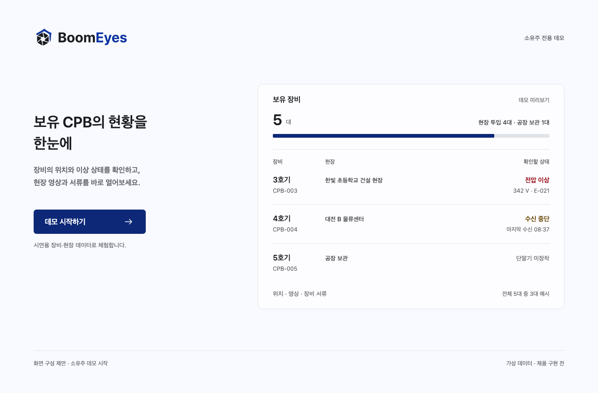
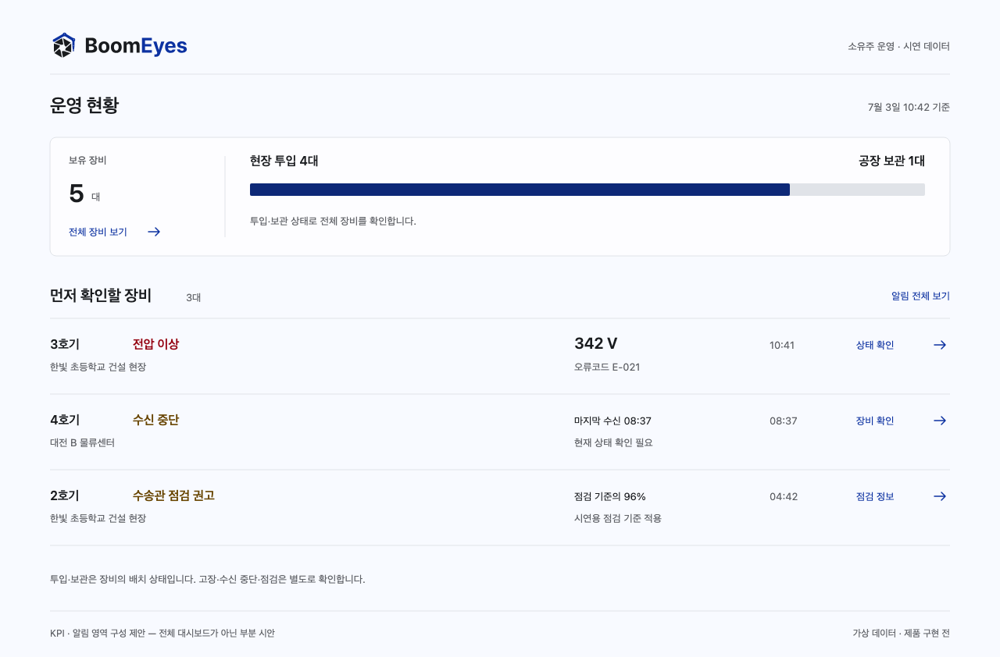

# 소유주 데모 — 디자인 진단과 개선안

2026-09-11 · 내부 검토용 · 화면 구성안 v3(소유주 모의 의견 반영)

후속 구현: [AI 개발·전체 검증 실행 계획](../plans/owner-demo-implementation-plan.md). 작업 순서·AC·검증 증거·독립 리뷰·고객 검토는 해당 계획에서 관리한다.

## 1. 판단

**현재 화면은 컴포넌트의 모양은 통일되어 있지만, 소유주가 무엇부터 보고 무엇을 할지에 대한 시각적 우선순위가 약하다.** 작은 글자를 넣은 카드·표·설명 패널이 반복되고, 지도·영상·서류처럼 제품의 가치를 보여줄 대상이 작거나 빠져 있다. 색·그림자·아이콘을 추가하기 전에 화면별 주인공과 정보의 순서를 바꿔야 한다.

앞선 [화면 정의·평가서](../plans/owner-demo-screen-review.md)는 기능 대응과 누락을 주로 평가했다. 그 문서의 “구성이 적절하다”는 판단은 6개 업무 화면의 범위에 관한 것으로, 현재 디자인의 완성도를 인정한 판정이 아니다. 이번 문서는 시각적 구성, KPI의 의미, 텍스트, 주요 행동, 고객용 진입을 추가로 평가한다.

**소유주용 데모의 첫 장은 ‘소유주 데모 시작’으로 교체한다.** 현재의 6역할 선택 화면은 고객에게 보여줄 진입안으로 사용하지 않는다. 핵심 화면은 6개를 유지하고, 문서에는 공통 진입 1장과 업무 화면 6장을 합쳐 7장으로 보여준다. 실서비스의 계정·비밀번호 로그인은 별도 인증 설계 대상이다.

**v3 보완:** [소유주 페르소나 모의 검토](OWNER-PERSONA-FEEDBACK-2026-09-11.md)를 통해 장비 검색·계약·담당자 확인을 앞세웠다. 지도 비율과 영상 우선 행동은 고정하지 않는다. 아래 이미지 2장은 v2 정적 시안이며, 진입 미리보기에 정상 운영 장비·계약 정보를 추가하는 작업은 다음 시안 수정 항목이다. 모의 의견은 실제 고객의 요구 확정이 아니다.

### 검토 범위와 증거

- 고객 근거: 사용자가 지정한 V5 엑셀 `관제기능` 시트. 파일명·해시·셀 대응은 [기준 문서 §2–3](../plans/owner-demo-screen-review.md)에 기록했다.
- 구현 기준: `30302591ef2df68251796299ceec4821c3f44870`. 빌드 preview에서 얻은 [9개 화면과 관찰 기록](evidence/owner-demo-2026-09-11/inspection.json)을 재검토했다.
- 운영 현황·영상·서류·계약·알림 이동·로그인은 실제 화면을 평가했다. 독립된 장비 목록·전체 상세는 아직 없으므로 **제안 설계**로 구분한다. 소유주 PWA의 자리 화면은 완성된 UI처럼 평가하지 않는다.
- 아래 판정은 전문가 검토다. 사용자 테스트나 정량적인 만족도 점수로 포장하지 않는다. 시안의 대수·시각은 별도로 표시한 가상 예시다.

## 2. 덜 완성되어 보이는 공통 원인

| 원인 | 실제 관찰 | 디자인에 미치는 영향 | 개선 규칙 |
|---|---|---|---|
| 정보의 무게가 같음 | 현황 상단에 9개 KPI. 총량·비율·현재 상태가 같은 숫자 크기와 테두리 | 먼저 볼 숫자가 없고 서로 비교 가능한 지표처럼 읽힘 | 보유 규모 1개를 기준점으로, 투입·보관은 구성비, 이상은 확인할 목록으로 표현 |
| 업무마다 같은 골격 | 현황·서류·계약이 요약 카드 → 표 → 우측 패널 | 어느 페이지에서도 새로운 업무 목적이 드러나지 않음 | 현황은 지도, 목록은 탐색, 상세는 장비, 영상은 재생 화면, 서류는 원문, 알림은 발생 내용을 중심에 둠 |
| 실제 콘텐츠 폭 부족 | 1280px에서 메뉴 240px, 상시 상세 360px. 현황 중앙은 약 616px, 지도는 약 360px | 넓은 모니터에서도 정보가 좁은 칸에 갇힘 | 상세는 선택 후 열고 본문 폭을 우선 확보. 화면 종류에 따라 전체 상세·미리보기로 전환 |
| 테두리와 작은 상자가 과다 | 카드 안 계기 타일, 알림 카드, 작업 카드, 작은 숫자 카드가 같은 표면 언어를 반복 | 영역 경계는 많지만 내용의 중요도 차이가 보이지 않음 | 배경·제목·간격으로 섹션을 구분. 테두리는 선택 가능한 객체나 독립된 작업 단위에 사용 |
| 정보가 문장으로 붙음 | 호기·고장명·코드·측정값이 한 문장. 문서명·현장명은 말줄임 | 사용자가 매번 읽어서 구조를 복원해야 함 | 핵심 명칭 → 맥락 → 수치/시각의 3단계. 숫자는 단위와 정렬하고 긴 고유명사는 필요한 만큼 줄바꿈 |
| 공간을 비효율적으로 사용 | 계약 2행 위에 KPI 4개. 서류는 우측 메타 몇 줄 뒤 큰 빈 공간 | 여백은 많지만 작업 대상은 작아 ‘만들다 만’ 인상 | 항목이 적으면 자연스러운 여백을 허용. 채우기용 KPI를 줄이고 실제 원문·선택 장비에 공간을 줌 |
| 행동과 대상이 어긋남 | 전압 이상에서 들어간 수신함에 교육 이수증 승인 버튼이 강조 | 가장 눈에 띄는 버튼을 눌러도 원래 목적을 달성하지 못함 | 선택 대상·제목·증거·주요 행동을 같은 호기/알림으로 고정 |
| 반응형이 정보 삭제로 끝남 | 1024px에서는 상세 숨김, 390px에서는 메뉴 240px 유지 | 데스크톱을 축소한 인상이며 실제 확인 경로도 사라짐 | 좁아지면 같은 정보를 별도 상세로 이동. 본문 폭과 탐색 경로를 함께 설계 |

색상 대비나 컴포넌트 정렬이 통과해도 위 문제는 남는다. 이번 검토의 핵심은 **예쁜 상자의 수보다 사용자가 한눈에 구별할 정보의 종류**다.

## 3. KPI Pattern 재설계

### 3.1 현재 패턴에서 무엇이 잘못됐는가

현재 [운영 현황](evidence/owner-demo-2026-09-11/02-owner-dashboard.png)의 KPI는 보유 5대·가동률 67%·오늘 타설량 220m³·타설 중 2대와, 가동/주의/고장/두절/정비 각 1대를 연속 배치한다. ‘가동 1대’의 실제 설명은 ‘정상 텔레메트리 수신’이다. 값이 수학적으로 틀렸다고 단정할 수는 없지만, 서로 다른 상태와 시간 범위를 같은 지표군처럼 보여준다.

또한 첫 묶음은 4열, 다음 묶음은 3열로 줄바꿈되어 두 줄이 된다. 약 310px 높이의 KPI 영역 뒤에 지도가 나오고, 영상은 전체 캡처 하단에 밀린다. 카드 힌트는 의미를 설명해야 하지만 작은 글씨와 말줄임으로 중요 정보가 약해진다.

### 3.2 숫자를 세 가지 표현으로 나눈다

| 종류 | 적합한 표현 | 예시 | 사용 조건 |
|---|---|---|---|
| 전체와 구성 | 전체 대수 + 하나의 가로 구성 막대 + 항목별 대수 | 보유 5대 / 현장 투입 4대 · 공장 보관 1대 | 동일 시각·동일 소유주 기준. 상태가 배타적이고 합계가 일치할 때. 상태 미확정은 별도 항목으로 포함 |
| 기간에 따른 양·비율 | 값 + 실제 추이 + 기간/분모 | 오늘 타설량, 장비별 가동률 | 유효한 시계열·시간 범위·계측 대상이 있을 때만. 비교 자료가 없으면 증감 화살표·가짜 스파크라인을 넣지 않음 |
| 지금 확인할 일 | 종류별 짧은 행 + 대수/건수 + 해당 목록 이동 | 고장 1대, 수신 중단 1대 | 중복 가능한 상태임을 반영. 장비 수와 발생 건수를 섞어 합산하지 않음 |

첫 화면에서는 **운영 구성 요약 1영역과 확인할 장비 목록**이면 충분하다. 타설량·가동 추이는 호기 상세에서 보여준다. 보관 비율을 가동률이라고 부르지 않는다. 모든 숫자에 도넛·게이지를 붙이는 방식은 정보 관계를 더 명확하게 만들지 못한다.

### 3.3 지표 정의와 화면 이동

| 표시 | 정의 제안 | 클릭 후 | 예외 처리 |
|---|---|---|---|
| 보유 장비 | 소유주 범위 내 고유 호기 수 | 전체 장비 | 장비가 없으면 0대와 빈 상태 |
| 현장 투입 / 공장 보관 | 해당 시점의 운영 배치 상태별 호기 수 | 같은 상태로 필터한 목록 | 상태가 없으면 ‘상태 미확인’. 정비 중도 장소 상태와 분리 |
| 고장 | 아직 해소되지 않은 고장이 있는 고유 호기 수 | 고장 장비 목록 | 1대에 여러 고장이 있어도 대수는 1. 발생 건수는 알림 화면에서 별도 집계 |
| 수신 중단 | 수신이 예상되는 장비 중 수신 기준을 넘긴 호기 수 | 수신 중단 목록 | 보관 중 단말기 미장착과 구분. 기준은 확정된 설정을 사용 |
| 점검 필요 | 적용 가능한 부품 기준에 따라 점검 대상인 호기 수 | 해당 장비 또는 점검 알림 | 기준이 없으면 ‘기준 미등록’. 데이터 없음이 0건/정상으로 보이지 않게 함 |
| 가동률 | 산식·분모·대상·시간 범위를 먼저 정의 | 호기별 시간 추이 | 서로 다른 산식의 평균을 전체 가동률로 표현하지 않음 |

위 정의는 제안이다. 투입·보관 필드는 현재 샘플에 없으므로 새 시안을 기존 5대 시드의 계산 결과라고 제시하지 않는다.

### 3.4 KPI를 쓰지 않을 곳

- **장비 목록:** 전체/투입/보관의 필터 건수로 충분하다. 현황의 KPI를 반복하지 않는다.
- **서류:** 문서 종류와 호기로 찾는 기능을 먼저 둔다. 현장·장비·사람의 완비율을 평균 낸 57%는 하나의 준비 상태로 해석하기 어렵다. 필수 서류 집합·중복·분모가 정의되기 전에는 대표 완비율을 제거한다.
- **계약 기간:** 호기 상세에 설치일·계약 시작일·종료일을 같은 시간축으로 정렬한다. 작은 계약 목록 위에 4개의 숫자 카드를 두지 않는다.
- **영상·알림 상세:** 발생 내용·영상 자체를 보여준다. 요약 숫자 영역을 의무적으로 넣지 않는다.

## 4. 페이지별 개선 명세

### 공통 진입 — 소유주 데모 시작

**현 상태:** [6개 역할 카드](evidence/owner-demo-2026-09-11/01-login.png), 제조사 카드 기본 강조, `owner01` 같은 계정 ID, 역할별 기능 설명. 고객은 제품을 보기 전에 조직 구분과 내부 계정을 이해해야 한다.

**교체안:** 브랜드 → 소유주용 한 문장 → 실제로 보게 될 장비 요약 미리보기 → 단일 시작 버튼. PC는 설명과 미리보기를 나란히, 휴대폰은 브랜드·문장·버튼을 먼저 배치한다. 미리보기는 데모의 같은 장비 자료를 사용하며 시연 데이터임을 표시한다. 다음 시안에서는 이상 장비뿐 아니라 정상 장비와 계약 정보도 포함해 평소 운영 가치를 보여준다.

| 요소 | 제안 카피·동작 |
|---|---|
| 대상 표시 | 소유주 전용 데모 |
| 제목 | 보유 CPB의 현황을 한눈에 |
| 설명 | 장비의 위치와 이상 상태를 확인하고, 현장 영상과 서류를 바로 열어보세요. |
| 주 버튼 | **데모 시작하기 →** |
| 데이터 안내 | 시연용 장비·현장 데이터로 체험합니다. |
| 시작 결과 | 소유주 범위의 운영 현황. 역할 선택이나 추가 설정 없이 진입 |
| 준비 실패 | 같은 위치에 ‘데모를 불러오지 못했습니다’와 재시도. 다른 역할 화면으로 보내지 않음 |

비밀번호 입력란·회원가입·회사 선택을 시연에 필요하지 않은 장식으로 추가하지 않는다. 이 교체안은 소유주 데모의 진입 설계다. 기존 공통 로그인과 역할 가드를 실제로 수정할 때는 [shell-auth 명세](../../specs/shell-auth/spec.md)의 계정 분기 수용 기준도 함께 정리해야 한다.

*문서용 정적 시안. 제품 구현 캡처가 아니다. 5대·투입 4대·보관 1대는 구성 설명을 위한 가상 데이터다.*

### ① 운영 현황 — ‘위치’와 ‘먼저 확인할 장비’

- **주인공:** 넓은 지도와 짧은 우선 확인 목록. 현재의 9개 KPI와 상시 우측 장비 패널은 첫 화면의 집중을 분산한다.
- **배치:** 제목/기준 시각·호기/현장 검색 → 한 줄 운영 구성 → 지도와 확인할 장비 → 선택 호기의 간단한 요약. 검색과 전체 목록 진입을 첫 화면에 둔다. 지도 2/3 비율은 고정 기준에서 제외하고 사용 과제에 따라 조정한다.
- **알림 밀도:** 호기·이상명 한 줄, 현장·시각 한 줄, 필요한 측정값과 자세히 보기. 일부 항목만 보여줄 때는 전체 영향 장비 수·현재 표시 수·전체 보기를 함께 둔다. 3건은 시안 예시이며 확정 규칙이 아니다. 정상 안내·서류 만료·과거 정비 이력은 한 피드로 섞지 않는다.
- **주요 행동:** 지도/목록에서 호기 선택 → 상세 보기. 지표를 누르면 같은 조건의 전체 목록. 지도 선택과 상관없이 3호기 상세를 처음부터 강조하지 않는다.
- **상태:** 마지막 위치는 마지막 수신 시각과 함께 표시. 위치 미수신·장비 없음·지도 조회 실패를 구분한다. 지도 실패 중에도 장비 목록으로 찾을 수 있게 한다.
- **판정 기준:** 1280×842 첫 화면에서 운영 구성·지도·우선 확인 장비를 볼 수 있다. 반복 KPI 때문에 지도가 아래로 밀리지 않는다.

*KPI와 텍스트 계층의 부분 시안. 전체 대시보드가 아니다. 고장·수신 중단은 투입/보관과 다른 축이며 합계에 더하지 않는다.*

### ② 보유 장비 목록 — ‘찾고 비교하기’

**제안 설계:** 현재 이상 장비 표는 전체 장비 목록을 대신할 수 없다.

- 검색 → 운영 상태 필터 → 결과 수 → 전체 폭의 장비 목록으로 구성한다. 첫 열은 ‘3호기’, 보조 식별자로 `CPB-003`을 사용한다.
- PC 기본 열은 호기, 현장/건설사, 투입·보관, 확인할 상태, 계약 종료일. 설치 일정·계약 전체 기간·마지막 수신은 상세 또는 필요한 보조 열에서 확인한다. 좁은 화면에 8열을 그대로 압축하지 않는다.
- 호기/현장처럼 의미가 다른 두 정보는 2줄 셀을 허용한다. 숫자와 날짜는 일정하게 정렬하고, 고장처럼 주의가 필요한 상태만 강조한다.
- 행 선택 → 호기 상세. 호기명·종료일마다 다른 버튼을 반복하지 않는다. 모바일은 같은 정보를 호기 카드로 바꾼다.
- **판정 기준:** 긴 현장명·보관 호기·검색 결과 0건에서도 내용을 식별하고 복귀할 수 있다. 100대 이상 샘플 검토 시 검색·필터·페이지 전환을 확인한다. 5대 시연에서는 100대를 보유했다고 표시하지 않는다.

### ③ 호기 상세 — ‘한 대의 상태와 다음 행동’

**현 상태:** [대시보드 우측](evidence/owner-demo-2026-09-11/02-owner-dashboard.png)에 통신·전압·3상·단선·코드·타설량·업무가 모여 있다. [계약 화면](evidence/owner-demo-2026-09-11/05-owner-leases.png)에는 일정·담당자가 따로 있다. 기술 수치가 비슷한 무게로 나열되고 연락·영상·서류 연결은 약하다.

- **배치:** 호기/현장/상태/수신 시각과 계약 기간·담당자를 상단에서 확인 → 중요 이상 1영역 → 상태·영상·서류의 명확한 이동 → 장비 상태·점검 정보·설치/계약 일정 상세. 계약·담당자가 영상 아래로 일괄 밀리지 않게 한다.
- 정상 항목은 간결한 상태 행으로, 이상 항목은 ‘전압 이상 / 342 V / E-021 / 발생 시각’으로 묶는다. 이상과 관련된 추가 측정값은 펼쳐서 본다.
- 타설량 차트는 충분한 폭과 축·단위를 확보하고 이 화면에 배치한다. 산출식·관경 등은 ‘산출 기준’의 보조 설명으로 이동한다.
- 설치·계약은 날짜를 서로 정렬해 보여준다. 소유주가 정보를 확인할 때 재배치 입력 폼을 먼저 열지 않는다.
- **주요 행동:** 방문 목적에 따라 장비 상태·영상·서류를 쉽게 찾도록 한다. ‘영상 보기’를 항상 첫 행동으로 고정하지 않는다. 진입 링크는 관련 부분으로 안내하되 공통 상세 배치를 매번 바꾸지는 않는다. 담당자는 읽기 쉬운 이름으로 표시한다.
- **판정 기준:** 어떤 폭에서도 상세 페이지에 도달한다. 상태·영상·서류의 호기가 같고, 결측 값은 정상처럼 표시되지 않는다.

### ④ 영상 보기 — ‘영상이 가장 크게’

**현 상태:** [영상 모달](evidence/owner-demo-2026-09-11/03-owner-video.png)에 채널 탭·라이브/스냅샷·서버/SD·녹화·7일·AI 점수·재전송 안내가 같은 시각적 층위에 있다. 라이브와 스냅샷 표시가 함께 보여 현재 보는 영상의 상태가 불명확하다.

- 상단은 호기·현장, 시간 모드 ‘실시간 / 저장 영상’, 해당 모드의 채널 선택으로 정리한다. 채널은 타설 위치·마스트 설치·연계 작업 영상처럼 용도로 부른다.
- 영상 영역을 본문의 주 영역으로 만든다. 외곽에 현재 상태·수신 시각을 모으고, 영상 위에는 장면 이해에 필요한 최소 표시만 둔다.
- 저장 모드에서만 날짜·확보된 구간·재생 위치를 보여준다. 서버/SD 등 저장 위치는 필요할 때 보조 정보로 확인한다.
- V5의 안전 감지 카메라는 실시간 채널 선택의 기본 항목으로 두지 않는다. 가동 1일분 예시와 실제 보존 정책은 구분한다.
- **판정 기준:** 한눈에 어느 호기·어떤 용도·실시간 또는 어느 시각의 저장분인지 읽힌다. 끊김·저장분 없음·시연용 영상 상태가 섞이지 않는다.

### ⑤ 장비 서류 — ‘원문을 찾아 보여주기’

**현 상태:** [서류 화면](evidence/owner-demo-2026-09-11/04-owner-documents.png)은 4개 KPI와 대상별 완비율이 상단을 차지하고, 표는 코드·유형·대상·현장을 반복한다. 우측에는 파일 본문 대신 몇 줄의 메타데이터가 보인다. 장비 제작증보다 교육 이수증이 첫 대상이다.

- 상단은 호기/서류 종류 찾기와 ‘서류 첨부’. 목록을 고르기 전에는 전체 폭, 고른 뒤에는 목록 약 1/3·읽을 수 있는 파일 미리보기 약 2/3로 배치한다.
- 행은 **문서명 → 호기·현장 → 등록일/유효기간** 순서. 문서 ID는 세부 정보로 이동한다. 제작증·비파괴 검사 성적서를 먼저 시연한다.
- 유효기간이 있는 문서에만 만료일을 표시한다. 필수 목록을 정의하지 않은 상태에서 ‘누락 0건’이나 완비율을 만들지 않는다.
- **주요 행동:** 선택 파일 열기. 첨부는 독립된 작업으로 시작·미리보기·결과를 보여준다. 모바일에서는 원문을 별도 전체 화면으로 연다.
- **판정 기준:** 문서 종류와 대상 호기를 읽을 수 있고, 메타데이터뿐 아니라 파일 본문이 보인다. 원문을 닫으면 같은 목록 위치로 돌아온다.

### ⑥ 이상·점검 알림 — ‘어느 장비의 무엇을 확인하는가’

**현 상태:** [고장 알림 이동 결과](evidence/owner-demo-2026-09-11/06-owner-alert-destination.png)에 전압 이상 업무와 다른 교육 이수증 승인 폼이 동시에 있다. 데이터 연결 문제이면서 가장 강한 버튼이 잘못된 대상을 가리키는 디자인 문제다.

- 목록은 장비 이상 / 점검을 구분하고, 제목·호기·현장·발생 시각을 읽는 순서에 맞춰 배치한다. 발생 건수와 영향 장비 수는 구분한다.
- 상세는 ‘3호기 전압 이상’ → 측정값/발생 시각/오류코드 → 같은 장비 상태·관련 영상 → 후속 기록 순서다.
- **주요 행동:** 장비 상태 확인. 관련 영상은 해당 영상이 있을 때 제공한다. 승인·반려·정비 종결 등 다른 업무의 행동이 끼어들지 않게 한다.
- 이미 읽음/미확인과 고장 해소 여부를 시각적으로 구분한다. 새 알림이 들어와도 보고 있는 대상을 임의로 바꾸지 않는다.
- **판정 기준:** 진입 알림·상세 제목·선택 호기·행동의 대상이 모두 일치한다. 기록이 없으면 빈 이력, 영상이 없으면 해당 상태를 표시한다.

## 5. 텍스트 나열을 바꾸는 규칙

| 현재 표현 | 개선 표현 | 이유 |
|---|---|---|
| 소유주 운영 WEB / 관제 대시보드 / 관제 대시보드 | 메뉴 ‘운영 현황’, 본문 제목 ‘운영 현황’, 탑바는 회사/데모 맥락 | 헤더에 같은 제목을 반복하지 않음 |
| CPB-003 380V 전압 이상 (E-021) — 342V | 제목 ‘3호기 · 전압 이상’ / 값 ‘342 V’ / 보조 ‘E-021 · 발생 시각 · 현장’ | 읽는 순서와 의미를 분리 |
| 가동 1대 / 정상 텔레메트리 수신 | ‘정상 수신 1대’ 또는 건강 상태의 보조 정보 | 운영 가동으로 오해하지 않게 함 |
| DOC-004 / 비파괴 검사 성적서 / CPB-002 비파괴 검… | ‘비파괴 검사 성적서’ / ‘2호기 · 한빛 초등학교 건설 현장’ | 필요한 문서명에 가장 많은 폭을 배정 |
| LS-001 · OWN-001 | ‘1호기 · 한빛 초등학교 건설 현장’ / 계약 기간 | 코드보다 사용자가 아는 대상을 우선 |
| 누적 3,910m³ · 산출 기준안 D125… | ‘누적 타설량 3,910 m³’ / ‘산출 기준’에서 상세 | 판단할 값과 계산 설명을 분리 |
| 홍보 연계: … 원본 니즈: 추가 일거리 확보 | 제품 화면에서 제거하고 데모 발표자 노트에 기록 | 고객이 수행할 행동과 기획 근거를 구분 |
| 준비 중 / — | ‘단말기 미장착’, ‘아직 수신되지 않음’, ‘파일 없음’ 등 실제 원인 | 결측·보관·장애의 차이를 이해하게 함 |

큰 글자는 제목·핵심 값, 본문은 장비/문서의 이름, 작은 글자는 시간·코드에 사용한다. 의미가 다른 정보를 모두 작은 회색 텍스트로 맞추지 않는다. 고유명사와 오류 내용은 무조건 한 줄로 자르지 않으며, 핵심 정보 확인을 마우스 `title`에 의존하지 않는다.

## 6. 디자인 시스템에서 조정할 부분

이번 문제는 개별 페이지의 조립과 공통 패턴 지침 모두에 걸쳐 있다. [이전 리뷰](REVIEW-2026-09-07.md)의 ‘토큰은 유지하고 구현을 정리한다’는 방향을 색·간격의 일관성에는 적용할 수 있지만, 소유주 데모의 정보 구성까지 해결하는 것으로 볼 수는 없다.

| 구분 | 검토 근거 | 개선 방향 |
|---|---|---|
| 페이지 패턴 | [원칙](../../packages/tokens/src/doc/00-principles.md)의 ‘한 페이지 한 골격’, [페이지 규칙](../../packages/tokens/src/doc/04-page.md)의 KPI→표→인스펙터 | 공통 셸은 유지하되 ‘현황 / 탐색 / 상세 / 뷰어’ 유형을 명시. KPI·우측 패널은 필요한 화면에서 선택 |
| 표 밀도 | [웹 지침](../../packages/tokens/src/doc/06-web.md)의 36px·한 줄·두 줄 셀 금지 | 식별자·숫자는 간결하게, 문서명/현장명은 2줄을 허용하는 의미 기준 마련 |
| KPI 구조 | [Stat](../../packages/ui/src/primitives/Stat.svelte), [StatGroup](../../packages/ui/src/primitives/StatGroup.svelte) | 단일 수치 컴포넌트는 유지. 전체/구성·기간 추이·확인할 일의 조합 규칙을 분리하고 실제 컨테이너 폭에 맞춰 열 수 결정 |
| 상세 접근 | [Inspector](../../packages/ui/src/shell/Inspector.svelte)의 `hidden … xl:flex` | 패널 표시 여부와 상세 접근을 분리. 좁은 화면의 별도 상세 경로를 설계 |
| 카피 | [표현 지침](../../packages/tokens/src/doc/05-copy.md), [KeyValueList](../../packages/ui/src/primitives/KeyValueList.svelte) | 코드·라벨 나열에 앞서 사용자 명칭과 핵심 값의 우선순위를 규정 |

기존 색·상태 어휘·브랜드·접근성 기준을 활용한다. 새 화면만을 위한 임의 토큰이나 다크 전용 구조는 필요하지 않다. 본 문서는 개선안을 제시하며 원천 지침·생성물은 아직 수정하지 않았다. 구현 단계에서는 관련 spec·원천 지침·재생성을 함께 다룬다.

## 7. 실행 순서와 통과 기준

아래 우선순위는 소유주 데모 디자인의 작업 순서다. 계약상 우선순위가 아니다.

| 순서 | 작업 | 결과를 평가할 기준 |
|---|---|---|
| 1 | 장비 검색·상세·반응형 연결 | 1280·1024·390px에서 정상/보관 장비도 찾고 계약·담당자를 확인. 상세를 숨겨 기능을 잃지 않음 |
| 2 | 현재 상태와 마지막 수신 정보 구별 | 위치·측정값·영상에 시각 표시. 보관·미장착·수신 중단 구분. 결측을 정상으로 표시하지 않음 |
| 3 | 장비 서류 원문 열람 | 선택한 호기의 제작증·검사 성적서가 읽히고 닫은 뒤 같은 목록으로 복귀 |
| 4 | 고객용 진입 교체 | 소유주용임이 첫 화면에 보이고 ‘데모 시작하기’ 1개로 현황 진입. 미리보기에 일상 운영도 포함 |
| 5 | 운영 요약·페이지 골격 조정 | 보유/투입/보관 합계 일치. 검색·지도·확인할 장비 접근. 알림 일부 표시 시 전체 규모도 확인 |
| 6 | 영상·알림 이동과 대상 정리 | 영상 용도·시간 상태 일관. 선택 알림과 주요 행동의 장비 일치. 관련 없는 승인 폼 없음 |
| 7 | 타이포·여백·카피 정돈 | 같은 의미는 같은 표현. 주요 명칭·고유명사·값의 잘림 없음. 정상/이상/결측 구별 |

이 순서는 핵심 과제를 성립시키기 위한 내부 작업 순서다. 고객에게 보여주는 순서는 진입 화면부터이며, 진입 교체는 공개 전 필수 조건으로 유지한다.

### 검증 방식

1. 같은 가상 장비 세트로 진입 → 현황 → 목록 → 상세 → 영상/서류/알림을 검토한다. 상태별 숫자·호기·시각이 연결되는지 확인한다.
2. 1280×842, 1024×842, 390×800의 첫 화면과 상세를 캡처한다. 좁은 화면에서 같은 정보를 읽고 이동할 수 있어야 한다.
3. 긴 현장명, 서류명, 이상 여러 건, 보관/미장착, 미수신, 데이터 0건을 넣어 밀도와 문구를 검토한다.
4. 고객 검토에서는 ‘내 장비 찾기’, ‘이상 호기 확인’, ‘제작증 열기’를 안내 없이 시도하게 한다. 성공 여부·헤맨 지점·소요 시간을 기록한다. 아직 실시하지 않았다.
5. 구현 후 게이트·접근성·시각 캡처를 함께 확인한다. 현재 정적 시안을 기능 검증 증거로 사용하지 않는다.

### 이번 수정의 검증 기록

- 실제 구현의 증거: 기존 빌드 preview 9장. 이번 리뷰에서는 해당 캡처와 관련 코드를 대조했다.
- 문서용 시안: 소유주 진입, 운영 구성/우선 확인 패턴 2장. 기존 DY 토큰 색·타입과 브랜드 자산을 사용한 정적 구성이다.
- 문서 참조·서식 검사 결과는 [화면 정의·평가서 §9](../plans/owner-demo-screen-review.md)에 함께 기록한다.
